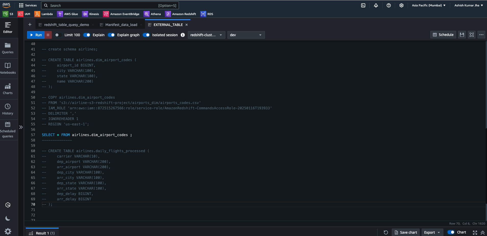
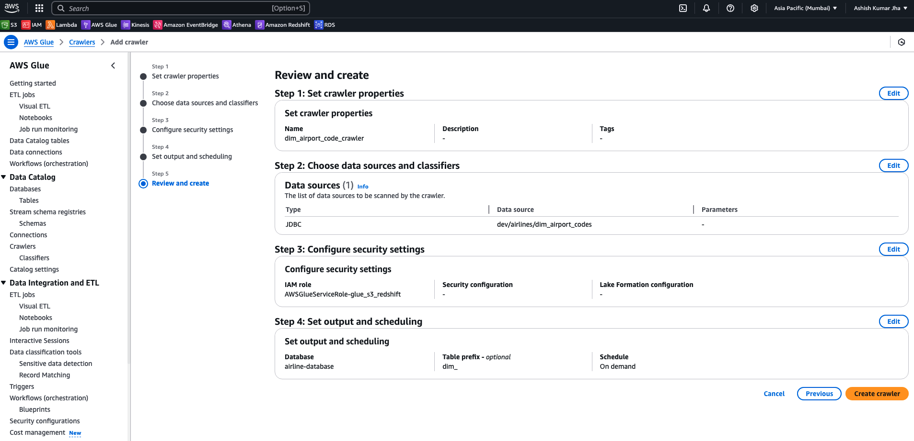
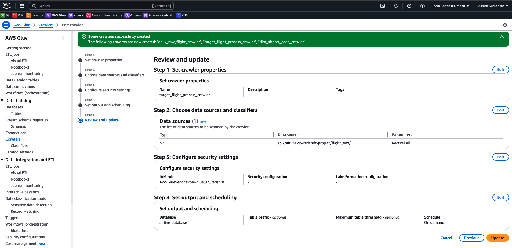
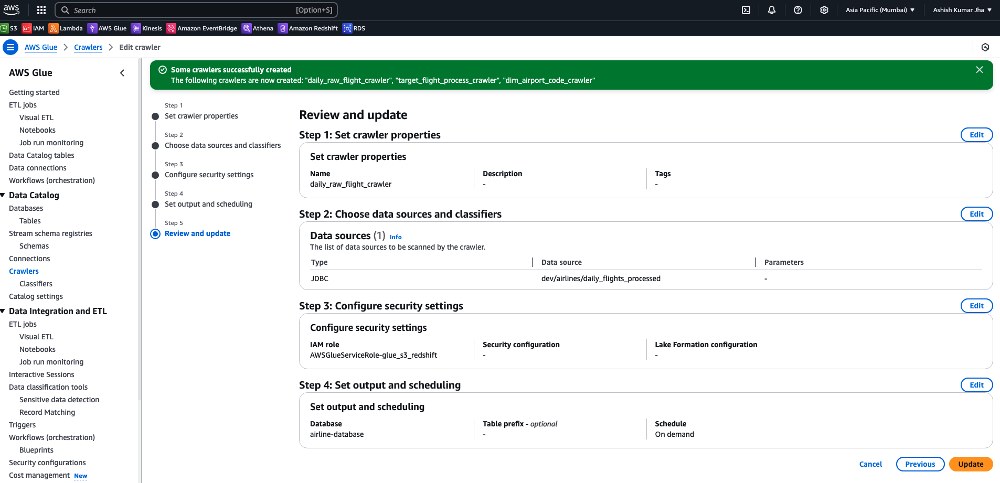
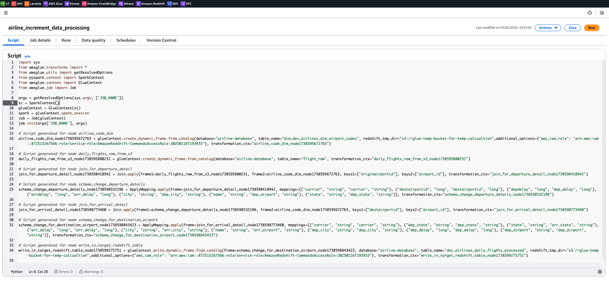
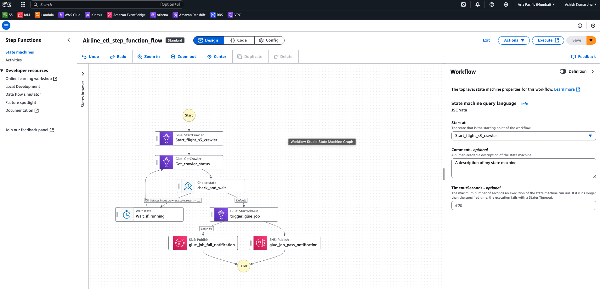
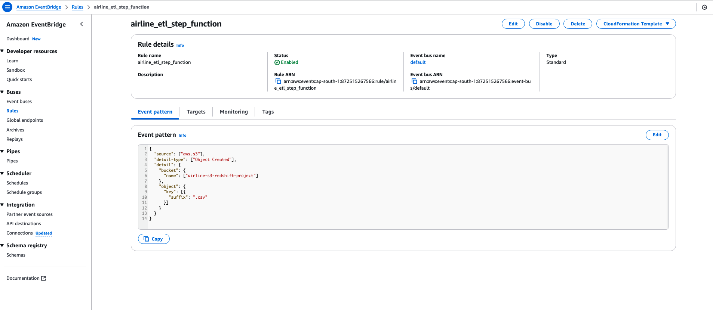

# Airline Data Ingestion Incrementally 

---

## Project Overview
This project demonstrates an incremental data ingestion pipeline designed for the airline industry. It leverages multiple AWS services to ingest, process, and catalog daily flight data and static airport codes. The system is built to process data incrementally using AWS Glue Job Bookmarks, ensuring efficient data processing without reprocessing historical data.

## Tech Stack
- **Programming Language:** Python
- **Storage:** AWS S3
- **Orchestration:** AWS Step Functions, AWS EventBridge
- **Data Processing:** AWS Glue (ETL Jobs, Job Bookmarking)
- **Data Cataloging:** AWS Glue Crawler, AWS Glue Catalog
- **Data Warehousing:** AWS Redshift
- **Notification:** AWS SNS

## Prerequisites
Before starting the implementation, ensure you have:
- An AWS account with permissions for S3, Glue, Redshift, Step Functions, EventBridge, and SNS.
- Data files for **airport_codes** and daily **flights**.
- Basic knowledge of Python and AWS services.
- AWS CLI configured for your environment.

## Step-by-Step Implementation

### 1. Upload Data to AWS S3
#### Steps:
1. **Airport Codes Data**: Upload a CSV or JSON file containing airport codes to an S3 bucket. This data typically includes fields like airport code, name, city, state, country, etc.
2. **Daily Flights Data**: Upload daily flight data files to the same or a separate S3 bucket. Ensure the file naming convention includes the date (e.g., `date=YYYY-MM-DD/flights.csv`) for easier incremental processing.

Example S3 Bucket Structure:
```
s3://airline-data/
    ├── airport_codes/
    │   └── airport_codes.csv
    └── daily_flights/
        ├── date=2025-01-01/flights.csv
        ├── date=2025-01-02/flights.csv
        └── ...
```

### 2. Setup Redshift Tables
#### Steps:
1. **Pre-Loaded Table for Airport Codes**:
   - Create a table in Redshift to store the airport codes.
   - Load the pre-existing airport_codes data into this table using COPY commands or through a SQL client.

2. **Target Table Schema for Daily Flights**:
   - Define a target table schema in Redshift that matches the structure of your daily flights data.
   - Ensure that the schema supports incremental updates.

Example SQL (Redshift):
```sql
-- Create table for airport_codes
create schema airlines;

CREATE TABLE airlines.dim_airport_codes (
    airport_id BIGINT,
    city VARCHAR(100),
    state VARCHAR(100),
    name VARCHAR(200)
);

COPY airlines.airports_dim
FROM 's3://airlines-dataset-gds/airports.csv' 
IAM_ROLE 'arn:aws:iam::348532040329:role/service-role/AmazonRedshift-CommandsAccessRole-20230820T081203'
DELIMITER ','
IGNOREHEADER 1
REGION 'us-east-1';

--------------

CREATE TABLE airlines.daily_flights_processed (
    carrier VARCHAR(10),
    dep_airport VARCHAR(200),
    arr_airport VARCHAR(200),
    dep_city VARCHAR(100),
    arr_city VARCHAR(100),
    dep_state VARCHAR(100),
    arr_state VARCHAR(100),
    dep_delay BIGINT,
    arr_delay BIGINT
);
```

### 3. Configure AWS Glue Crawler
#### Steps:
1. **For S3 Data (Daily Flights)**:
   - Create a Glue Crawler that points to the S3 path where the daily flights data is stored.
   - Set the crawler to create/update the table in the Glue Catalog.

2. **For Redshift Data (Airport Codes and Daily Flights)**:
   - Create another Glue Crawler for the Redshift tables.
   - Configure the connection to Redshift and set the crawler to catalog the pre-loaded airport_codes and target daily_flights tables.


### 4. Create AWS Glue Job for Incremental Data Processing
#### Steps:
1. **Job Configuration**:
   - Create a new AWS Glue ETL job using Python (PySpark).
   - Configure the job to use the Job Bookmarking feature. This ensures that only new or modified data (daily flights) is processed.

2. **ETL Script**:
   - Write a script to read the new flight data from S3.
   - Apply any necessary data validation and transformation.
   - Load the processed data into the target Redshift table using the COPY command or Glue’s JDBC connection.

Example Glue Job Script Outline (Python):
```python
import sys
from awsglue.transforms import *
from awsglue.utils import getResolvedOptions
from awsglue.context import GlueContext
from awsglue.job import Job
from pyspark.context import SparkContext

args = getResolvedOptions(sys.argv, ['JOB_NAME'])
sc = SparkContext()
glueContext = GlueContext(sc)
spark = glueContext.spark_session
job = Job(glueContext)
job.init(args['JOB_NAME'], args)

# Read the incremental flights data from S3
flights_df = glueContext.create_dynamic_frame.from_options(
    connection_type="s3",
    connection_options={"paths": ["s3://airline-data/daily_flights/"]},
    format="csv",
    format_options={"withHeader": True}
)

# Perform any necessary transformation
# (e.g., data cleaning, type casting, filtering, etc.)

# Write the transformed data to Redshift
glueContext.write_dynamic_frame.from_jdbc_conf(
    frame=flights_df,
    catalog_connection="redshift-connection",
    connection_options={
        "dbtable": "daily_flights",
        "database": "your_database_name"
    },
    redshift_tmp_dir="s3://airline-data/temp/"
)

job.commit()
```
#### Real code file -> [code](./glue_etl_job.py)
3. **Enable Job Bookmarking**:
   - In the job properties, ensure Job Bookmarking is enabled so that only new files are processed during each run.

### 5. Configure AWS SNS for Notifications
#### Steps:
1. Create an SNS Topic to receive notifications for Glue job success or failure.
2. Subscribe relevant email addresses or endpoints to the SNS Topic.
3. Configure the AWS Glue job to send notifications to the SNS Topic upon completion or failure.

### 6. Create AWS Step Functions Workflow
#### Steps:
1. **Define the Workflow**:
   - Create a Step Function state machine that orchestrates the Glue job.
   - Define states for starting the Glue job, checking its status, and handling success or failure notifications.

2. **Sample State Machine Definition (Amazon States Language)**:
```json
{
  "Comment": "A description of my state machine",
  "StartAt": "Start_flight_s3_crawler",
  "States": {
    "Start_flight_s3_crawler": {
      "Type": "Task",
      "Arguments": {
        "Name": "daily_raw_flight_crawler"
      },
      "Resource": "arn:aws:states:::aws-sdk:glue:startCrawler",
      "Next": "Get_crawler_status"
    },
    "Get_crawler_status": {
      "Type": "Task",
      "Arguments": {
        "Name": "daily_raw_flight_crawler"
      },
      "Resource": "arn:aws:states:::aws-sdk:glue:getCrawler",
      "Output": {
        "crawler_state_result": ""
      },
      "Next": "check_and_wait"
    },
    "check_and_wait": {
      "Type": "Choice",
      "Choices": [
        {
          "Next": "Wait_if_running",
          "Condition": "",
          "Output": {
            "output": ""
          }
        }
      ],
      "Default": "trigger_glue_job"
    },
    "Wait_if_running": {
      "Type": "Wait",
      "Seconds": 10,
      "Next": "Get_crawler_status"
    },
    "trigger_glue_job": {
      "Type": "Task",
      "Resource": "arn:aws:states:::glue:startJobRun.sync",
      "Arguments": {
        "JobName": "airline_increment_data_processing"
      },
      "Catch": [
        {
          "ErrorEquals": [
            "States.TaskFailed"
          ],
          "Next": "glue_job_fail_notification"
        }
      ],
      "Next": "glue_job_pass_notification"
    },
    "glue_job_pass_notification": {
      "Type": "Task",
      "Resource": "arn:aws:states:::sns:publish",
      "Arguments": {
        "Message": {
          "Job": "airline_increment_data_processing",
          "Status": "Glue job pass"
        },
        "TopicArn": "arn:aws:sns:ap-south-1:872515267566:sns_email_test"
      },
      "End": true
    },
    "glue_job_fail_notification": {
      "Type": "Task",
      "Resource": "arn:aws:states:::sns:publish",
      "Arguments": {
        "TopicArn": "arn:aws:sns:ap-south-1:872515267566:sns_email_test",
        "Message": {
          "Job": "airline_increment_data_processing",
          "Status": "Glue job failed",
          "Error": ""
        }
      },
      "End": true
    }
  },
  "QueryLanguage": "JSONata"
}
```

### 7. Configure AWS EventBridge Notification
#### Steps:
1. **Create an EventBridge Rule**:
   - Define an EventBridge rule that listens for specific events (e.g., a new file arrival in the S3 bucket or a schedule trigger).
   - Set the rule to trigger the Step Function workflow.
  
2. **Rule Configuration**:
   - Configure the event pattern (for S3 put events, use detail-type or source filters).
   - Set the target as the Step Function state machine ARN.

Example EventBridge Rule Configuration:
```json
{
  "source": ["aws.s3"],
  "detail-type": ["Object Created"],
  "detail": {
    "bucket": {
      "name": ["airlines"]
    },
    "object": {
      "key": [{
        "suffix": ".csv"
      }]
    }
  }
}
```
 
- Alternatively, you may schedule the rule to trigger at a specific time daily if processing is time-bound.

## Monitoring & Logging
- **AWS CloudWatch Logs**: Enable logging for Glue jobs, Step Functions, and Redshift queries.
- **AWS Glue Metrics**: Monitor job run times, success rates, and data volumes.
- **Redshift Query Performance**: Use Redshift’s performance insights to monitor the load process.
- **SNS Notifications**: Ensure timely notifications for troubleshooting and operational insights.

## Conclusion
This project sets up an incremental data ingestion pipeline for airline data by integrating AWS S3, Glue, Redshift, Step Functions, SNS, and EventBridge. The solution efficiently handles daily data loads, leverages Glue’s Job Bookmarking for incremental processing, and ensures a robust monitoring and notification system to facilitate seamless data operations.

<!-- ## References
- [AWS Glue Documentation](https://docs.aws.amazon.com/glue/latest/dg/what-is-glue.html)
- [AWS Step Functions Documentation](https://docs.aws.amazon.com/step-functions/latest/dg/welcome.html)
- [AWS Redshift Documentation](https://docs.aws.amazon.com/redshift/latest/dg/welcome.html)
- [AWS SNS Documentation](https://docs.aws.amazon.com/sns/latest/dg/welcome.html)
- [AWS EventBridge Documentation](https://docs.aws.amazon.com/eventbridge/latest/userguide/) -->

